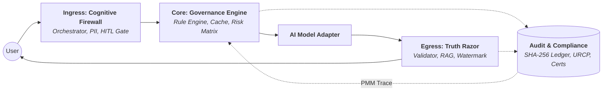

# 🛡️ SIA Framework — Sovereign Systemic Integrity Architecture

[](LICENSE)
[](https://www.python.org/)
[](https://artificialintelligenceact.eu/)
[](#)

**SIA** is a production-grade **Governance-as-Code (GaC)** middleware that wraps any AI/ML model in a deterministic, EU AI Act–compliant oversight layer. It enforces legal compliance as **runtime logic**, not post-hoc policy.

> **"Opacity is a technical defect. All reasoning paths must be human-interpretable, audit-ready, and decoupled from the probabilistic noise of the primary engine."**

---

## 📌 The Black Box Paradox & The Solution

Modern enterprise AI operates on probabilistic weights, yet legal frameworks (EU AI Act, GDPR, HIPAA) demand deterministic, binary compliance. Soft prompt engineering cannot provide legally defensible governance. 

**SIA bridges this gap** by installing the *Sovereign Stack* — a deterministic governance mesh that intercepts, audits, and validates every AI request and response at the runtime level.

---

## ⚡ Core Capabilities (v0.2.0)

- **Unified Privacy-as-Safety (GDPR & HIPAA)**: Enforces dynamic routing based on the Unified Sensitive Data Schema. Applies *GDPR Purge* (Right to Erasure) for EU subjects, and *HIPAA Vault* (6-year archival lock) for US subjects via cryptographic pseudonymization.
- **Unified Regulatory Compliance Package (URCP)**: Automated generation of Annex IV Technical Documentation, ISO 14971 Risk Reports, GDPR DPIA, and HIPAA OCR Evidence straight from the CLI or Monitoring API.
- **ISO 14971 Risk Management Module**: Dedicated hazard matrix tracking Pre-mitigation vs Residual Risk Priority Numbers (RPN). Runtime incidents are dynamically traced back to specific Hazard IDs.
- **Deterministic Guardrails**: RAG grounding (`Truth Razor`), prompt injection defense, and PII sanitization running as strict runtime gates.
- **The Human Veto**: High-risk tasks automatically trigger an `HTTP 202` pausing execution until a Human-in-the-Loop provides authorization.

---

## 🏗️ Architecture: The Sovereign Stack



- **Layer 1: Contextual Ingress Orchestrator**: Intent Classification, PII sanitization, and Human-in-the-Loop review gates prior to model exposure.
- **Layer 2: Governance Engine**: Evaluates binary logic gates against the master `eu_ai_act_full.yaml` matrix and handles the ISO 14971 risk scoring.
- **Layer 3: Deterministic Egress Validator**: Grounding checks (RAG), minimum confidence thresholds, and dynamic legal disclaimers/watermarks before reaching the user.

---

## 🚀 Quick Start

### Installation

```bash
# Core package
pip install sia-framework

# With OpenAI / Anthropic support
pip install sia-framework[openai,anthropic]
```

### 30-Second Integration

```python
from sia.adapters.client import SIAClient
from sia.adapters.openai_adapter import OpenAIAdapter

# 1. Choose your AI provider
adapter = OpenAIAdapter(model="gpt-4o")

# 2. Wrap it with SIA
client = SIAClient(adapter=adapter)

# 3. Call .chat() instead of the raw API
response = client.chat("What are the company's vacation policies?")

print(response.content)       # Governed output
print(response.action)        # PASSED | BLOCKED | HUMAN_VETO | REWRITTEN
print(response.risk_score)    # 0.0 – 100.0
print(response.trace_hash)    # SHA-256 cryptographic audit anchor
```

### Zero-Refactor Decorator

Wrap your existing functions natively:

```python
from sia.adapters.client import SIAClient, governed
from sia.adapters.mock_adapter import MockAdapter

client = SIAClient(adapter=MockAdapter())

@governed(client=client)
def my_ai_function(prompt: str) -> str:
    return raw_llm_api(prompt)
```

---

## 📊 Live Monitoring Dashboard & Reports

SIA includes a self-contained HTML monitoring dashboard to track Post-Market Monitoring (PMM) metrics and Privacy/Data protection KPIs live.

```bash
# Start the monitoring server on port 8001
py src/sia/monitoring/api.py
```
Open `http://127.0.0.1:8001` in your browser. From the dashboard, you can monitor live telemetry or download the **Unified Regulatory Compliance Package (URCP)** directly.

---

## 📁 Project Structure (Abridged)

```
sia-framework/
├── src/sia/                      
│   ├── adapters/                 # Model provider integrations (OpenAI, Claude, etc.)
│   ├── core/                     # Governance engine & rule evaluation
│   ├── ingress/                  # Firewall, sanitizers, intent classification
│   ├── egress/                   # Truth Razor, output validation, watermarking
│   ├── traceability/             # Audit ledger & URCP generation
│   ├── regulatory/               # Article 43 conformity checklist
│   └── monitoring/               # FastAPI metrics server & dashboard
├── configs/                      # Governance-as-Code YAML presets
├── dashboard/                    # HTML/JS Live Compliance Dashboard
└── docs/                         # Extensive technical documentation
```

---

## 🤝 Contributing

We welcome contributions to the **Sovereign Systemic Integrity Architecture**. For information on how to add new adapters or regulatory profiles, please see `CONTRIBUTING.md`.

## 📄 License

SIA Framework is released under the **MIT License**. See `LICENSE` for details.
