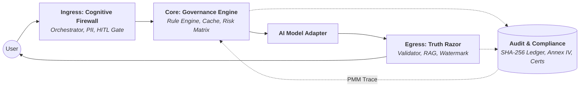

# 🛡️ SIA Framework — Sovereign Systemic Integrity Architecture

[](LICENSE)
[](https://www.python.org/)
[](https://artificialintelligenceact.eu/)
[](#)

**SIA** is a production-grade **Governance-as-Code (GaC)** framework that wraps any AI/ML model in a deterministic, EU AI Act–compliant oversight layer. It enforces legal compliance as **runtime logic**, not post-hoc policy.

> **"Opacity is a technical defect. All reasoning paths must be human-interpretable, audit-ready, and decoupled from the probabilistic noise of the primary engine."**
> — The Sovereign Pentad

---

## 📌 The Problem SIA Solves

Modern enterprise AI faces a critical structural risk — the **Black Box Paradox**:

- LLMs operate on probabilistic weights, not deterministic logic.
- Legal frameworks (EU AI Act, GDPR) demand deterministic, auditable, binary compliance.
- Soft prompt engineering cannot provide legally defensible governance.
- One non-compliant inference can constitute a regulatory breach with organizational liability.

**SIA bridges this gap** by installing a *Technical Conformity Controller* — a deterministic governance mesh that intercepts, audits, and validates every AI request and response at the runtime level, before legal exposure materializes.

---

## 🏛️ The Sovereign Pentad (Design Principles)

| #   | Principle                      | Description                                                                            |
| --- | ------------------------------ | -------------------------------------------------------------------------------------- |
| 1   | **Deterministic Transparency** | All decision paths are human-interpretable, cryptographically hashed, and audit-ready  |
| 2   | **The Human Veto**             | Human agents retain absolute authority; the system cannot override human intervention  |
| 3   | **Algorithmic Truth**          | Factuality over helpfulness; zero-tolerance for hallucinations via RAG grounding       |
| 4   | **Radical Data Hygiene**       | PII and bias are excised at the source before reaching the model                       |
| 5   | **Antifragile Resilience**     | Adversarial inputs (prompt injections, jailbreaks) are detected and blocked at ingress |

---

## 🏗️ Architecture: The Sovereign Stack

SIA wraps the primary AI model in a **Zero-Trust Supervisory Mesh** with three specialized layers:




### Layer 1: Contextual Ingress Orchestrator (Cognitive Firewall)
Intercepts every prompt **before** it reaches the model:
- **Intent Classification** — Hybrid keyword + optional LLM-based Annex III risk tier detection.
- **PII Sanitization** — Regex-based automatic redaction (email, SSN) before the model sees the data.
- **HITL Review Gate** — Pauses inference for high-risk requests, requiring human sign-off via the Monitoring API.
- **Governance Gates** — Evaluates all EU AI Act `runtime_gate` rules from `eu_ai_act_full.yaml`.

### Layer 2: Rule Evaluation Engine (Governance Core)
The enforcement brain. Evaluates rules in three taxonomy tiers based on **ISO 14971** hazards:
- **Hazard Mapping** — Every rule is traced back to a specific Hazard ID in the `iso_14971_hazards.yaml`.
- **RPN Calculation** — Dynamically evaluates Risk Priority Numbers (Severity x Probability) to determine block/rewrite logic.
- **Rule Tiers**:
  - `runtime_gate`: Per-request binary logic gates (e.g., Article 5 prohibitions).
  - `deployment_assertion`: System-level health and configuration checks at startup.
  - `governance_doc`: Organizational obligations satisfied by evidence artifacts. SIA acts as a registry for non-runtime requirements (e.g., **Article 17 QMS Manuals** or **Article 18 Technical Documentation**), ensuring they are linked and verified before the final **Conformity Certificate** is issued.

### Layer 3: Deterministic Egress Validator (Truth Razor)
Validates model output **before** it reaches the user:
- **Confidence Gate** — Blocks/rewrites responses below the minimum confidence threshold (default 0.85).
- **RAG Grounding** — Uses the `Truth Razor` engine to verify factual claims against local vector stores.
- **AI Watermarking** — Appends mandatory transparency disclosure and `X-SIA-AI-Generated` headers (Art. 13 & 50).
- **Dynamic Disclaimer** — Injects context-aware legal/medical disclaimers based on the detected intent.

### 📜 Compliance & Audit Ledger
Foundational cross-cutting concern for **Article 12 & 72** compliance:
- **SHA-256 Traceability** — Every interaction is hashed into `audit_ledger.jsonl`.
- **Post-Market Monitoring (PMM)** — Runtime incidents are automatically traced back to the ISO 14971 hazard matrix.
- **Auto-Reporting** — One-click generation of Annex IV evidence and ISO 14971 Risk Reports.

---

## ⚖️ EU AI Act Coverage

SIA implements deterministic runtime enforcement for the following articles:

| Article        | Subject                 | Implementation                                                                                |
| -------------- | ----------------------- | --------------------------------------------------------------------------------------------- |
| **Art. 5**     | Prohibited AI Practices | BLOCK 451 — subliminal manipulation, social scoring, real-time biometrics, exploit vulnerable |
| **Art. 9**     | Risk Management         | Deployment assertion — Annex III categories must be declared at startup                       |
| **Art. 10.2f** | Bias/Data Governance    | BLOCK 400 — hate speech, racial profiling, discriminatory inference                           |
| **Art. 10.3**  | PII/Data Quality        | TRANSFORM — PII redacted before model exposure                                                |
| **Art. 10.5**  | Special Category Data   | BLOCK 403 — health, genetic, political, religious data                                        |
| **Art. 11**    | Technical Documentation | Deployment assertion — system metadata must be present                                        |
| **Art. 12**    | Record-Keeping          | SHA-256 cryptographic ledger appended to every inference                                      |
| **Art. 13.1**  | Transparency            | AI-generated watermark footer on every compliant response                                     |
| **Art. 13.2**  | Capability Disclaimers  | Dynamic domain-specific disclaimers (healthcare, employment, legal)                           |
| **Art. 14.4**  | Human Oversight         | HTTP 202 + webhook — Annex III tasks paused for human veto                                    |
| **Art. 15.1**  | Accuracy                | BLOCK 422 — responses below 0.85 confidence rewritten                                         |
| **Art. 15.3**  | RAG Grounding           | BLOCK 422 — unverified factual claims blocked                                                 |
| **Art. 15.4**  | Cybersecurity           | BLOCK 400 — prompt injection, jailbreak patterns detected at ingress                          |
| **Art. 50.1**  | AI Content Marking      | `X-SIA-AI-Generated: true` HTTP header on every response                                      |
| **Art. 50.2**  | Synthetic Media         | BLOCK 451 — deepfake/synthetic voice generation requests                                      |
| **Art. 53**    | GPAI Copyright          | BLOCK 422 — non-allowlisted RAG sources rejected                                              |
| **Art. 72**    | Post-Market Monitoring  | Anomaly detection — 5 consecutive blocks triggers alert flag                                  |
| **Art. 43**    | Conformity Assessment   | Interactive checklist + cryptographically signed certificates                                 |

---

## 🚀 Quickstart

### Installation

```bash
# Core framework (no LLM provider dependencies)
pip install sia-framework

# With OpenAI support
pip install sia-framework[openai]

# With Anthropic Claude support
pip install sia-framework[anthropic]

# Development / testing
pip install sia-framework[dev]
```

> **Requirements:** Python 3.9+

### 30-Second Integration

```python
from sia.adapters.client import SIAClient
from sia.adapters.openai_adapter import OpenAIAdapter

# 1. Choose your AI provider
adapter = OpenAIAdapter(model="gpt-4o")  # Requires OPENAI_API_KEY env var

# 2. Wrap it with SIA — zero configuration needed for defaults
client = SIAClient(adapter=adapter)

# 3. Call .chat() instead of the raw API
response = client.chat("What are the company's vacation policies?")

print(response.content)       # Governed output
print(response.action)        # PASSED | BLOCKED | HUMAN_VETO | REWRITTEN
print(response.http_status)   # 200 | 400 | 403 | 422 | 451 | 202
print(response.risk_score)    # 0.0 – 100.0
print(response.trace_hash)    # SHA-256 cryptographic audit anchor
```

### The `@governed` Decorator (Zero-Refactor Integration)

Wrap any existing function without changing its internal logic:

```python
from sia.adapters.client import SIAClient, governed
from sia.adapters.mock_adapter import MockAdapter

client = SIAClient(adapter=MockAdapter())

@governed(client=client)
def my_existing_ai_function(prompt: str) -> str:
    # Your existing code — unchanged
    return call_my_llm_api(prompt)

# Call it exactly as before — SIA governs transparently
result = my_existing_ai_function("Analyze this resume for the position.")
# Returns: "[SIA HUMAN VETO] This request requires human review before processing."
```

Supports **sync**, **async**, and **async generator** (streaming) functions.

---

## 🔌 Model Adapters

SIA is provider-agnostic via the `ModelAdapter` protocol.

### OpenAI

```python
from sia.adapters.openai_adapter import OpenAIAdapter

adapter = OpenAIAdapter(model="gpt-4o")  # or gpt-4-turbo, gpt-3.5-turbo
# Requires: OPENAI_API_KEY environment variable
```

### Anthropic Claude

```python
from sia.adapters.anthropic_adapter import AnthropicAdapter

adapter = AnthropicAdapter(model="claude-3-5-sonnet-20241022")
# Requires: ANTHROPIC_API_KEY environment variable
```

### HuggingFace (Hosted or Local)

```python
from sia.adapters.huggingface_adapter import HuggingFaceAdapter

# Hosted Inference API
adapter = HuggingFaceAdapter(model_id="meta-llama/Llama-3.1-8B-Instruct")
# Requires: HF_TOKEN environment variable

# Local pipeline
adapter = HuggingFaceAdapter(model_id="gpt2", local=True)
```

### Custom Adapter

```python
from sia.adapters.base import ModelAdapter, ModelResponse

class MyCustomAdapter(ModelAdapter):
    @property
    def provider_name(self) -> str:
        return "my_provider"

    def generate(self, prompt: str, **kwargs) -> ModelResponse:
        raw_output = my_api.call(prompt)
        return ModelResponse(
            content=raw_output,
            confidence=0.90,
            rag_verified=False,
            provider=self.provider_name,
        )

    async def agenerate(self, prompt: str, **kwargs) -> ModelResponse:
        # Async version
        ...

    async def astream(self, prompt: str, **kwargs):
        # Streaming version — yield chunks
        ...
```

---

## 🌐 FastAPI Integration

### Option A: `SIAClient` per endpoint

```python
from fastapi import FastAPI
from sia.adapters.client import SIAClient
from sia.adapters.openai_adapter import OpenAIAdapter

app = FastAPI()
sia = SIAClient(adapter=OpenAIAdapter())

@app.post("/chat")
async def chat(prompt: str):
    response = await sia.achat(prompt)
    return {
        "content": response.content,
        "action": response.action,
        "compliant": response.compliant,
        "risk_score": response.risk_score,
    }
```

### Option B: `SIAMiddleware` (zero-code governance)

```python
from fastapi import FastAPI
from sia.integrations.fastapi import SIAMiddleware
from sia.adapters.openai_adapter import OpenAIAdapter

app = FastAPI()
app.add_middleware(
    SIAMiddleware,
    config_path="configs/eu_ai_act_full.yaml",
    adapter=OpenAIAdapter()
)

@app.post("/analyze")
async def analyze(prompt: str):
    # SIA intercepts automatically — this handler only runs for compliant requests
    return {"result": f"Processed: {prompt}"}
```

---

## 🖥️ Live Monitoring Dashboard

SIA ships with a real-time governance monitoring dashboard powered by FastAPI + WebSockets.

### Start the monitoring server

```bash
python -m uvicorn sia.monitoring.api:app --host 127.0.0.1 --port 8001
```

### Open the dashboard

Navigate to `http://127.0.0.1:8001` in your browser.

**Dashboard Features:**
- 📊 Live metrics: total requests, compliance rate, avg confidence
- 📈 Time-series charts (5-minute buckets, last 60 minutes)
- 📋 Action distribution: PASSED / BLOCKED / HUMAN_VETO / REWRITTEN
- 🚨 Article trigger frequency map
- 🔍 Real-time audit event feed
- ✅ Conformity Assessment progress tracker (Article 43)

### REST API Endpoints

| Method | Endpoint                         | Description                                    |
| ------ | -------------------------------- | ---------------------------------------------- |
| `GET`  | `/metrics`                       | Full metrics JSON snapshot                     |
| `GET`  | `/reviews`                       | Pending HITL review queue                      |
| `GET`  | `/conformity`                    | Conformity assessment progress                 |
| `POST` | `/conformity/check`              | Update a conformity checklist item             |
| `POST` | `/review/{hash}`                 | Submit human approve/reject decision           |
| `GET`  | `/report/annex-iv`               | Auto-generate Annex IV evidence report         |
| `GET`  | `/report/iso14971`               | Auto-generate ISO 14971 Risk Management Report |
| `GET`  | `/report/conformity-certificate` | Generate signed conformity certificate         |
| `WS`   | `/ws/metrics`                    | Real-time WebSocket metrics stream             |

---

## 🛡️ ISO 14971 Risk Management Module

SIA includes a dedicated risk management module aligned with **ISO 14971** standards, enabling structured hazard identification and mitigation traceability.

### Key Features:
- **Modular Hazard Matrix**: Hazards are defined in `configs/iso_14971_hazards.yaml`, separate from operational logic.
- **Automated Traceability**: Every mitigation rule (e.g., `STRIP_PII`, `BLOCK_PROMPT_INJECTION`) is mapped to a unique Hazard ID.
- **RPN Scoring**: Pre-mitigation and Residual Risk Priority Numbers (RPN) are calculated and sorted by criticality.
- **Post-Market Monitoring (PMM)**: The module dynamically traces runtime incidents (Article 72) back to their corresponding hazards in the risk matrix.

### Generating the Report:
```bash
# Manual generation
$env:PYTHONPATH="src"; py src/sia/cli/generate_risk_report.py
```
The report is also available dynamically via the Monitoring API at `/report/iso14971`.

---

## 📁 Project Structure

```
sia-framework/
├── src/sia/                      # Core library
│   ├── adapters/                 # Model provider integrations
│   │   ├── base.py               # ModelAdapter + ModelResponse protocol
│   │   ├── client.py             # SIAClient + SIAResponse + @governed decorator
│   │   ├── openai_adapter.py     # OpenAI Chat Completions (sync + async + stream)
│   │   ├── anthropic_adapter.py  # Anthropic Claude Messages API
│   │   ├── huggingface_adapter.py# HuggingFace Inference API + local pipeline
│   │   └── mock_adapter.py       # MockAdapter for testing
│   ├── core/                     # Governance engine
│   │   ├── config.py             # Pydantic models for YAML config
│   │   ├── engine.py             # RuleEvaluationEngine (ingress + egress)
│   │   ├── cache.py              # GovernanceCache (SHA-256 prompt dedup)
│   │   └── webhooks.py           # WebhookDispatcher (HITL notifications)
│   ├── ingress/                  # Ingress layer
│   │   ├── orchestrator.py       # ContextualIngressOrchestrator
│   │   ├── classifier.py         # IntentClassifier (keyword + LLM hybrid)
│   │   ├── sanitizer.py          # DataSanitizer (PII redaction)
│   │   └── governance_prompts.py # LLM prompts for zero-shot classification
│   ├── egress/                   # Egress layer
│   │   ├── validator.py          # DeterministicEgressValidator
│   │   └── signature.py          # Output signature utilities
│   ├── traceability/             # Audit trail
│   │   ├── ledger.py             # AuditLedger (SHA-256 JSONL)
│   │   ├── extractor.py          # ReasoningExtractor
│   │   └── reporter.py           # ComplianceReporter (Annex IV report generator)
│   ├── regulatory/               # Conformity & certification
│   │   ├── conformity.py         # ConformityAssessor (Art. 43 checklist)
│   │   └── certificates.py       # ConformityCertificate (signed JSON-LD)
│   ├── monitoring/               # Live observability
│   │   ├── api.py                # FastAPI monitoring server + WebSocket
│   │   └── metrics_collector.py  # MetricsCollector (reads audit_ledger.jsonl)
│   ├── integrations/
│   │   └── fastapi.py            # SIAMiddleware for FastAPI
│   └── cli/
│       └── main.py               # `sia` CLI (init, validate)
│
├── configs/                      # Governance-as-Code configuration
│   ├── eu_ai_act_full.yaml       # Master EU AI Act ruleset (all articles)
│   ├── conformity_checklist.yaml # Article 43 static assessment checklist
│   ├── sia_logic_gate.yaml       # Minimal gateway config
│   └── blueprints/               # Industry-specific presets
│       ├── healthcare_v1.yaml
│       ├── hr_recruitment_v1.yaml
│       ├── finance_v1.yaml
│       └── general_transparency.yaml
│
├── dashboard/
│   └── index.html                # Live monitoring dashboard (self-contained)
│
├── tests/
│   ├── test_poc.py               # Full EU AI Act integration test suite
│   ├── test_phase2.py            # Phase 2 unit tests
│   └── test_streaming.py         # Streaming governance tests
│
├── examples/
│   └── fastapi_governed.py       # FastAPI + SIAMiddleware example
│
├── docs/                         # Technical documentation
│   ├── SYSTEM_DESCRIPTION.md     # Annex IV system description
│   ├── RISK_MANAGEMENT_SUMMARY.md# Article 9 risk assessment
│   ├── TRACEABILITY.md           # Article 12 traceability evidence
│   ├── SIA_VALIDATION_REPORT.md  # Article 15 validation evidence
│   └── SIA_PHASE2_REPORT.md      # Phase 2 implementation report
│
├── logs/                         # Runtime data (gitignored)
│   └── audit_ledger.jsonl        # Cryptographic audit ledger
│
├── reports/                      # Generated compliance reports (gitignored)
├── pyproject.toml
├── LICENSE
└── README.md
```

---

## ⚙️ Configuration: Governance-as-Code

All compliance rules are defined in `configs/eu_ai_act_full.yaml`. The YAML is loaded at `SIAClient` startup and compiled into a Pydantic model for type-safe access.

### Custom Configuration

```yaml
# my_config.yaml
environments:
  active: ["prod"]

annex_iii_categories:
  healthcare: ["clinical", "diagnosis", "patient"]
  employment: ["resume", "hiring", "candidate"]

articles:
  article_5_prohibited_practices:
    paragraphs:
      article_5_1_a:
        description: "Block subliminal manipulation"
        rules:
          rule_block_subliminal:
            category: runtime_gate
            logic: "BLOCK_PROHIBITED_PRACTICES"
            api_response_on_block: 451
            practices: ["subliminal_manipulation"]
```

```python
client = SIAClient(
    adapter=adapter,
    config_path="my_config.yaml",
    environment="prod"
)
```

### Industry Presets via CLI

```bash
# Install CLI
pip install sia-framework

# Generate a Healthcare governance config
sia init --industry healthcare --output my_healthcare_config.yaml

# Generate an HR/Recruitment config
sia init --industry hr --output hr_config.yaml

# Validate a config file
sia validate my_healthcare_config.yaml
```

Available presets: `general`, `healthcare`, `hr`, `finance`

---

## 📜 Governance Response Reference

Every `SIAResponse` carries:

| Field               | Type    | Description                                                        |
| ------------------- | ------- | ------------------------------------------------------------------ |
| `content`           | `str`   | Governed output (may be rewritten)                                 |
| `compliant`         | `bool`  | Whether the response passed all gates                              |
| `action`            | `str`   | `PASSED` / `BLOCKED` / `HUMAN_VETO` / `REWRITTEN`                  |
| `article_triggered` | `str`   | EU AI Act article that triggered governance (e.g., `article_14_4`) |
| `trace_hash`        | `str`   | SHA-256 audit ledger hash                                          |
| `provider`          | `str`   | Model provider name                                                |
| `confidence`        | `float` | Model confidence score (0.0–1.0)                                   |
| `http_status`       | `int`   | Standard HTTP status reflecting governance outcome                 |
| `risk_score`        | `float` | Quantified compliance risk (0–100)                                 |
| `http_headers`      | `dict`  | Governance headers (e.g., `X-SIA-AI-Generated: true`)              |

### HTTP Status Code Semantics

| Code  | Meaning                                         | Article            |
| ----- | ----------------------------------------------- | ------------------ |
| `200` | Compliant, processed normally                   | —                  |
| `202` | Accepted, awaiting human review                 | Art. 14.4          |
| `400` | Blocked — prompt injection / token limit        | Art. 15.4          |
| `403` | Blocked — special category data                 | Art. 10.5          |
| `422` | Unprocessable — low confidence / hallucination  | Art. 15.1/3        |
| `451` | Blocked — prohibited practice / synthetic media | Art. 5 / Art. 50.2 |

---

## 🧪 Running Tests

```bash
# Install dev dependencies
pip install sia-framework[dev]

# Run the full EU AI Act integration validation suite
python tests/test_poc.py

# Run with pytest
pytest tests/ -v

# Run Phase 2 unit tests
pytest tests/test_phase2.py -v
```

### Demo Scripts

```bash
# Full pipeline demo with all EU AI Act scenarios
python demo_pipeline.py

# Human-in-the-Loop (HITL) demo
python demo_hitl.py

# Plug-and-play decorator demo (wraps a legacy external service)
python governed_integration.py

# Conformity certificate generation
python certification_run.py
```

---

## 🔐 Conformity Assessment (Article 43)

SIA implements a traceable conformity lifecycle:

```python
from sia.regulatory.conformity import ConformityAssessor
from sia.regulatory.certificates import ConformityCertificate

# Load the conformity checklist
assessor = ConformityAssessor(
    config_path="configs/conformity_checklist.yaml",
    state_path="logs/conformity_state.json"
)

# Get current assessment progress
progress = assessor.get_progress()
print(f"Conformity: {progress['overall_percent']}%")

# Generate a signed certificate
cert = ConformityCertificate(project_name="My AI System")
certificate = cert.generate(progress)
report = cert.to_markdown(certificate)
```

Or via the monitoring API:
```bash
curl http://127.0.0.1:8001/report/conformity-certificate
curl http://127.0.0.1:8001/report/annex-iv
```

---

## 📋 Generating Annex IV Evidence Reports

```python
from sia.traceability.reporter import ComplianceReporter

reporter = ComplianceReporter(ledger_path="logs/audit_ledger.jsonl")
reporter.generate_report(output_path="reports/ANNEX_IV_EVIDENCE.md")
```

---

## 🔔 HITL Webhook Notifications

Configure a webhook to receive Human-in-the-Loop notifications when Article 14.4 gates trigger:

```python
client = SIAClient(
    adapter=adapter,
    webhook_url="https://your-system.com/api/sia-review"
)
```

SIA will POST the following payload to your endpoint:

```json
{
  "event": "GOVERNANCE_INTERVENTION_REQUIRED",
  "article": "article_14_4",
  "trace_hash": "sha256:...",
  "prompt_preview": "Run resume scoring for...",
  "context": { "intent": "employment" },
  "system": "SIA-Framework-v1"
}
```

---

## 🗺️ Roadmap

- [ ] **v0.2.0** — Microsoft Presidio integration for production-grade PII detection
- [ ] **v0.2.0** — LangChain / LlamaIndex native integration
- [ ] **v0.3.0** — Vector DB RAG grounding verification
- [ ] **v0.3.0** — OpenTelemetry / Prometheus metrics export
- [ ] **v1.0.0** — Cryptographically signed conformity certificates (RSA, not mock)
- [ ] **v1.0.0** — Multi-jurisdiction rule packs (NIST AI RMF, ISO/IEC 42001)

---

## 🤝 Contributing

Contributions are welcome! Please read [CONTRIBUTING.md](CONTRIBUTING.md) before submitting a pull request.

1. Fork the repository
2. Create a feature branch: `git checkout -b feature/my-feature`
3. Run tests: `pytest tests/ -v`
4. Submit a pull request

---

## 📄 License

This project is licensed under the **MIT License** — see the [LICENSE](LICENSE) file for details.

---

## ⚠️ Disclaimer

SIA is an engineering framework designed to assist with EU AI Act compliance implementation. It does not constitute legal advice. Organizations deploying high-risk AI systems should engage qualified legal counsel for formal conformity assessment. The cryptographic signatures generated by this framework are SHA-256 hashes suitable for immutable audit trails; production deployments should use proper PKI infrastructure for legally binding digital signatures.

---

*Built with the conviction that regulatory compliance and engineering excellence are not opposing forces, but twin pillars of responsible AI deployment.*
