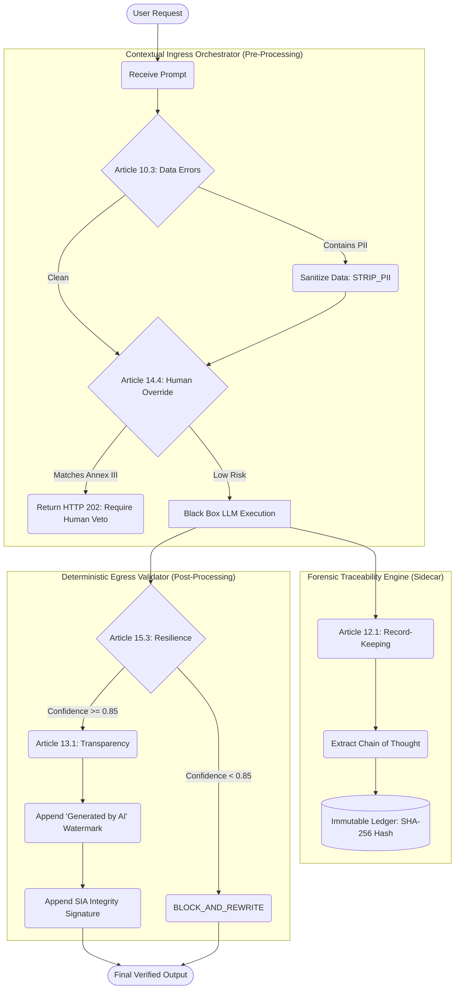

# EU AI Act Governance Traceability Matrix (Paragraph Level)

This document establishes human-readable traceability between the legal text of the **EU AI Act** and the deterministic technical controls implemented in the `configs/eu_ai_act_full.yaml` Governance-as-Code (GaC) configuration.

## Traceability Table

| EU AI Act Paragraph | Legal Requirement Summary | YAML Configuration Node | Technical Intervention |
| :--- | :--- | :--- | :--- |
| **Article 10.3** | Data sets must be relevant, representative, and free of errors. | `articles.article_10_data_governance.paragraphs.article_10_3.rules.pii_sanitization` | **Ingress**: Uses regex/NLP to dynamically strip PII (`STRIP_PII`) before it reaches the AI engine. |
| **Article 10.2(f)** | Examination in view of possible biases. | `articles.article_10_data_governance.paragraphs.article_10_2_f.rules.bias_check` | **Ingress**: Blocks requests containing domains known for discriminatory inference (`BLOCK_PROHIBITED_DOMAINS`). |
| **Article 12.1** | Automatic recording of events over the system's lifetime. | `articles.article_12_record_keeping.paragraphs.article_12_1.rules.traceability` | **Traceability**: Generates a SHA-256 hash anchoring the prompt to an immutable ledger (`REQUIRE_TRACEABILITY_HASH`). |
| **Article 12.2** | Record-keeping retention standards. | `articles.article_12_record_keeping.paragraphs.article_12_2.rules.retention` | **Traceability**: Enforces a `10_YEARS` retention policy. |
| **Article 13.1** | Users must be informed they are interacting with an AI system. | `articles.article_13_transparency.paragraphs.article_13_1.rules.watermarking` | **Egress**: Appends a verifiable text watermark (`APPEND_WATERMARK`) to the output. |
| **Article 14.4** | Human override and intervention for high-risk systems. | `articles.article_14_human_oversight.paragraphs.article_14_4.rules.hitl_gate` | **Ingress**: Detects keywords mapping to **Annex III** categories. Returns `HTTP 202 Accepted` for human signature (`REQUIRE_HUMAN_VETO`). |
| **Article 15.1** | Appropriate level of accuracy. | `articles.article_15_accuracy_robustness.paragraphs.article_15_1.rules.min_accuracy` | **Egress**: Enforces a `REQUIRE_MINIMUM_CONFIDENCE` threshold (0.85). |
| **Article 15.3** | Resilience against errors and faults (Hallucination filtering). | `articles.article_15_accuracy_robustness.paragraphs.article_15_3.rules.truth_razor` | **Egress**: Verifies facts against Truth-Centers (`REQUIRE_RAG_GROUNDING`). Executes `BLOCK_AND_REWRITE` on fail. |

---

## Architectural Visualization

The following diagram illustrates how the Sovereign Stack processes a request while explicitly enforcing the Paragraphs of the EU AI Act based on the YAML configuration.

