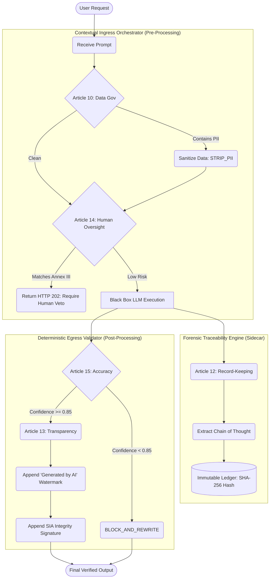

# EU AI Act Governance Traceability Matrix

This document establishes human-readable traceability between the legal text of the **EU AI Act** and the deterministic technical controls implemented in the `configs/eu_ai_act_full.yaml` Governance-as-Code (GaC) configuration.

## Traceability Table

| EU AI Act Article | Legal Requirement Summary | YAML Configuration Node | Technical Intervention |
| :--- | :--- | :--- | :--- |
| **Article 10** | Data Governance: Training, validation, and testing data must be relevant, representative, and error-free. | `articles.article_10_data_governance.rules.pii_sanitization` | **Ingress**: Uses regex/NLP to dynamically strip PII before it reaches the AI engine to prevent unauthorized data processing. |
| **Article 10** | Data Governance: Risk of biases must be addressed. | `articles.article_10_data_governance.rules.bias_check` | **Ingress**: Blocks requests containing domains known for discriminatory or prohibited inference. |
| **Article 12** | Record-Keeping: Automatic recording of events over the system's lifetime. | `articles.article_12_record_keeping.rules.traceability` | **Traceability**: Generates a SHA-256 hash anchoring the prompt, reasoning path, output, and score to an immutable ledger (`audit_ledger.jsonl`). |
| **Article 13** | Transparency: Users must be informed they are interacting with an AI system. | `articles.article_13_transparency.rules.watermarking` | **Egress**: Appends a verifiable text watermark (`APPEND_WATERMARK`) to the final output string. |
| **Article 14** | Human Oversight: High-risk systems must allow for human intervention and oversight. | `articles.article_14_human_oversight.rules.hitl_gate` | **Ingress**: Detects keywords mapping to **Annex III** categories (e.g., healthcare, employment). Pauses execution and returns `HTTP 202 Accepted` for human signature. |
| **Article 15** | Accuracy & Robustness: Systems must achieve an appropriate level of accuracy and resilience. | `articles.article_15_accuracy_robustness.rules.truth_razor` | **Egress**: The Truth Razor verifies facts against Authorized Truth-Centers. If confidence is `< 0.85`, it executes `BLOCK_AND_REWRITE`. |

---

## Architectural Visualization

The following diagram illustrates how the Sovereign Stack processes a request while explicitly enforcing the Articles of the EU AI Act based on the YAML configuration.

## Annex III High-Risk Mapping

The YAML dynamically maps intent categories to **Annex III** of the EU AI Act to trigger Article 14 rules:

- **Employment**: Triggers on `resume scoring`, `hiring`, `interview analysis`.
- **Healthcare**: Triggers on `clinical triage`, `medical diagnosis`, `treatment recommendation`.
- **Biometrics**: Triggers on `facial recognition`, `emotion inference`.
