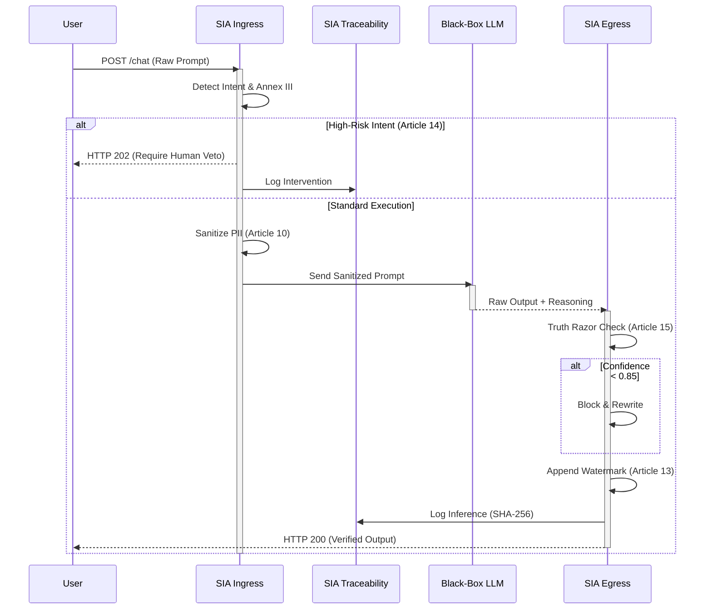

# SIA Framework: System Description and Architecture

**Document Version:** 1.1
**Date:** 2026-04-22

## 1. Product Vision & Intended Purpose

The **Sovereign Systemic Integrity Architecture (SIA)** is a deterministic Governance-as-Code middleware. Its intended purpose is to serve as a "Cognitive Firewall" that intercepts, evaluates, and modifies non-deterministic inputs and outputs associated with generative AI Large Language Models (LLMs). 

SIA is intended to enforce strict compliance with the **EU AI Act (Regulation EU 2024/1689)** for High-Risk AI systems.

**Indications for Use:**
- Sanitization of prompts containing Personally Identifiable Information (PII).
- Enforcement of Human-in-the-Loop (HITL) workflows for tasks classified under Annex III of the EU AI Act.
- Real-time hallucination filtering using Retrieval-Augmented Generation (RAG) grounding techniques.
- Forensic logging of AI reasoning paths for post-market surveillance.

**Contraindications:**
- SIA is *not* an AI model itself. It does not generate content.
- SIA does not perform model training or fine-tuning.

## 2. User Profiles and Operating Environment

### 2.1 Operator Profiles
- **End-Users:** Individuals interacting with the downstream LLM application (e.g., clinicians, HR managers). End-users interact indirectly with SIA.
- **Compliance Officers:** Regulatory personnel who review the `audit_ledger.jsonl` and generated `ANNEX_IV_EVIDENCE.md` reports.
- **System Administrators:** IT personnel responsible for configuring the `eu_ai_act_full.yaml` ruleset and deploying the FastAPI service.

### 2.2 Operating Environment
SIA is designed as a stateless, containerized microservice (Sidecar pattern). It is infrastructure-agnostic and interfaces via standard HTTP/REST protocols.

## 3. Architectural Design Specifications

SIA is composed of three primary deterministic sub-systems:

### 3.1 Contextual Ingress Orchestrator (`src/sia/ingress/`)
The pre-processing firewall.
- **IntentClassifier:** Evaluates the prompt against prohibited domains (e.g., hate speech, discriminatory logic) mapped to *Article 10.2(f)*.
- **DataSanitizer:** Utilizes regex and NLP (via stubs/Presidio) to identify and execute `STRIP_PII` on sensitive data elements before they reach the LLM, satisfying *Article 10.3*.
- **HITL Gatekeeper:** Scans for keywords related to Annex III categories. If detected, intercepts execution and returns an `HTTP 202 Accepted` status, enforcing *Article 14.4* (Human Override).

### 3.2 Deterministic Egress Validator (`src/sia/egress/`)
The post-processing "Truth Razor."
- **Grounding Engine:** Evaluates the LLM output against an expected confidence threshold (`MIN_CONFIDENCE`). 
- **Block and Rewrite:** If the confidence is below 0.85, the Truth Razor executes `BLOCK_AND_REWRITE` to prevent hallucinations (*Article 15.3*).
- **Transparency Watermark:** Appends a mandatory clear-text watermark to compliant outputs, explicitly stating AI generation (*Article 13.1*).

### 3.3 Forensic Traceability Engine (`src/sia/traceability/`)
The immutable audit layer.
- **ReasoningExtractor:** Captures internal Chain-of-Thought logs (`<thought>` tags).
- **AuditLedger:** Cryptographically anchors the entire transaction (Prompt, Sanitized Prompt, Output, Reasoning) using SHA-256 hashing. Satisfies *Article 12.1* (Record-Keeping).

## 4. Data Lifecycle and Sequence Flow

## 5. Technology Stack Justification
- **Python 3.11:** Primary language for AI integration.
- **FastAPI / Uvicorn:** Chosen for high-performance, asynchronous routing required for sidecar latency constraints.
- **Pydantic:** Strictly types and validates the complex, deeply nested EU AI Act YAML configurations to prevent runtime configuration errors.
- **PyYAML:** Parses the Governance-as-Code schemas.
